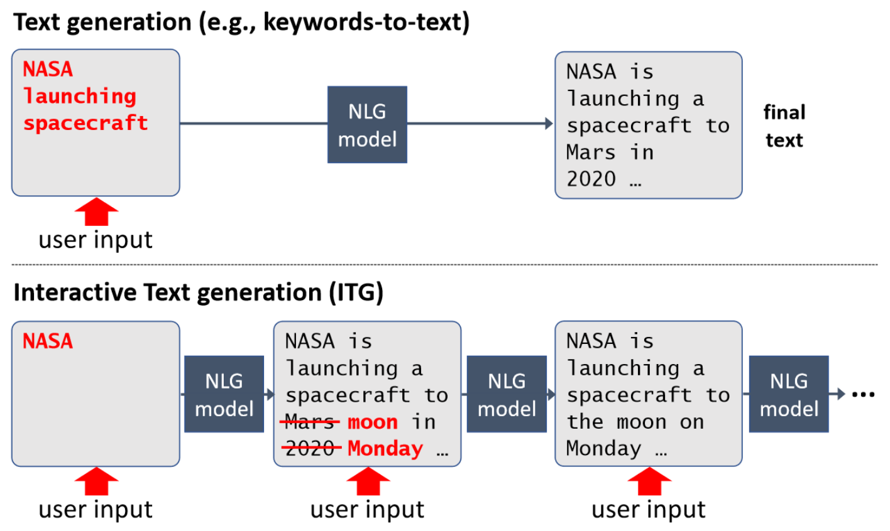

# Overview

This project offers an implementation of the paper:

**Interactive Text Generation**\
Felix Faltings, Michel Galley, Baolin Peng, Kianté Brantley, Weixin Cai, Yizhe Zhang, Jianfeng Gao, Bill Dolan\
[arXiv](https://arxiv.org/abs/2303.00908)

# Installation
 
Install dependencies using requirements.txt:
`pip install -r requirements.txt`
Then, install the package. From the top level directory (where `setup.py` is located), run:
`pip install -e .`
This will install this package as an editable module named `infosol`. 

Download model files (requires wget and zstd):
`sh ./scripts/dowload_models.sh`

# DATA

You can regenerate the data used in the paper using the `make_data.py` script. You only need to specify the `data_dir` argument where the data will be saved (under `data/cnn_bart`). This script first downloads the raw data (CNN/DailyMail) from the Huggingface hub. The script can easily be adapted to generate other textual datasets from the hub.

`python scripts/make_data.py --data_dir=data`
 
# Test
 
To replicate the main experiments of the paper, run:
 
`python scripts/make_eval_jobs.py --model_dir=models --data_dir=data/cnn --job_dir=jobs --out_dir=out`
 
The above command creates jobs files in 'jobs' directory, as well as the directory structure ('out') where test results will be stored. Then, you can pass any of the configuration files under 'jobs' as argument to `scripts/run_eval.py`. For example, run the following to replicate the BART-large 'interactive' experiments (Table 4 of the paper):
 
`python scripts/run_eval.py --args_path jobs/interactive/cnn-bart_editor_large --cuda_device 0`

Note: The S2S experiments of the paper yield generation that were inconsisent in length and hurt S2S performance. Thus, we tuned its length_penalty hyperparameter on a held out set, and the corresponding job files can be found in jobs/interactive/cnn-bart-s2s-len.
 
# Train
 
In order to train all the models presented in the paper, you may use the provided Makefile. Set the `run_dir` variable to the directory where you would like model weights to be saved to. You also need to set the `DATA_DIR` and `SAVE_DIR` paths in `train.py`.
 
# Code walkthrough
 
We suggest you go through the code in the order alignment -> model -> train/evaluate. Alignment defines some basic objects like alignments (used heavily by the oracle) and canvases (the objects that the model and oracle operate on). The others are self-explanatory and are commented.
 
The main files:
- alignment.py
- env.py
- evaluate.py
- models/word_edit_model.py
- run_eval.py
- train.py
- (decoding.py)
